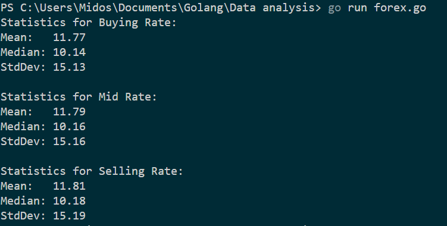

# Forex Data Analysis

This Go program reads data from a CSV file containing forex rates, computes statistics, and prints the results. The statistics include mean, median, and standard deviation for Buying Rate, Mid Rate, and Selling Rate.

## Usage

1. Ensure you have Go installed on your machine.
2. Clone the repository.

```bash
git clone <repository-url>
cd <repository-directory>
```
## Run the program
```bash
go run forex.go
```
## Provide the input CSV file (e.g., "data.csv").
Date,BuyingRate,MidRate,SellingRate
2023-01-01,1.200,1.250,1.300
2023-01-02,1.210,1.260,1.310
...


